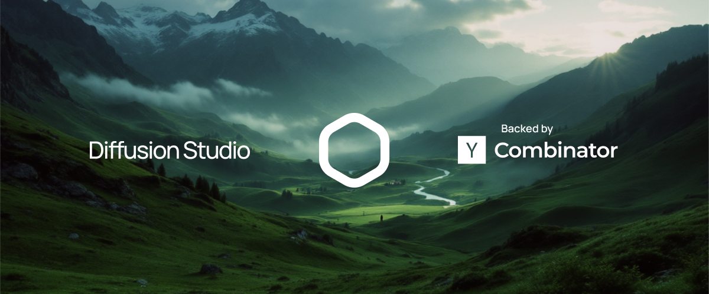

<p align="center">
  
  <h1 align="center">diffusionstudio/core</h1>
</p>

<p align="center">
  
  <a href="https://vitejs.dev"></a>
  <a href="https://discord.com/invite/zPQJrNGuFB"></a>
  <a href="https://x.com/diffusionhq"></a>
  <a href="https://www.ycombinator.com/companies/diffusion-studio"></a>
</p>
<br/>

# Getting Started
`@diffusionstudio/core` is a 2D motion graphics and video rendering engine powered by WebCodecs. Developers commonly use it for video editing automations and to build editing [playgrounds/web apps](https://playground.diffusion.studio).

## Documentation
Explore the full documentation at [our wiki](https://github.com/diffusionstudio/core/wiki).

## Credits
This project owes much to [@Vanilagy's](https://github.com/Vanilagy) exceptional muxer implementations.

## Why Use Diffusion Studio
💻 100% **client-side**<br/>
🪽 **Tiny bundle size** – Only 38 KB with a single dependency<br/>
🩸 Blazingly **fast** WebCodecs renderer<br/>
🦾 **AI-first** architecture<br/>

## Getting Started
```sh
npm install @diffusionstudio/core
```

## Basic Usage
Here’s an example of how to use the library:

```typescript
import * as core from '@diffusionstudio/core';

const source = await core.VideoSource
  .from('https://diffusion-studio-public.s3.eu-central-1.amazonaws.com/videos/big_buck_bunny_1080p_30fps.mp4');

// create a video clip and trim it
const video = new core.VideoClip(source) // compatible with the File API
  .subclip(0, 160); // The base unit is frames at 30 FPS

// create a text clip and add styles
const text = new core.TextClip({ 
  text: 'Bunny - Our Brave Hero', 
  position: 'center', 
  duration: 80, 
  stroke: { color: '#000000' } 
});

const composition = new core.Composition(); // 1920x1080

// this is how to compose your clips
await composition.add(video);  // convenience function for 
await composition.add(text);   // clip -> track -> composition

// render video using webcodecs at 25 FPS
// use resolution: 2 to render at 4k 
const blob = await new core.Encoder(composition, { fps: 25 }).render();
```

The API models the structure of conventional video editing applications like Adobe Premiere or CapCut, using a track-based system. The current state can be visualized like this:


Each track contains zero or more clips of a single type, arranged in ascending chronological order.

Tracks are created implicitly with `composition.add(clip)`, but you can also create them manually:

```typescript
const track = composition.createTrack('text');
await track.add(text0);
await track.add(text1);
await track.add(text2);
...
```

## Examples
Find more [examples here.](https://github.com/diffusionstudio/examples), or test all capabilities on our [Playground.]( https://app.diffusion.studio)

https://github.com/user-attachments/assets/7a943407-e916-4d9f-b46a-3163dbff44c3

## How Does Diffusion Studio Compare?

### Remotion
A React-based video creation tool that converts the DOM into videos. It’s beginner-friendly, allowing web developers to leverage their existing skills.

### Motion Canvas 
A standalone editor designed for high-quality animations. It features an imperative API, adding elements procedurally rather than relying on keyframes, making it ideal for detailed animations.

### Diffusion Studio
A video editing **library** rather than a framework with a visual interface. It’s lightweight, operates entirely on the **client-side**, and supports WebCodecs without relying on WebAssembly/ffmpeg. Ideal for integration into existing projects.

## Contributing

Currently, version ^2.0.0 is invite-only. You can request access on our Discord if you're interested in contributing. The source code for version ^1.0.0 is available in this repository.

## Current features
* **Video/Audio** trimming and offsets
* **Tracks & Layering**
* **Splitting** clips
* **Html & Image** rendering
* **Relative** units (e.g. 80% clip height)
* **Shapes** (e.g., rectangles, circles)
* **Text** with multiple styles
* **Audio Visualization**
* High Quality **Captions**
* **Silence Removal** for audio
* Web & Local **Fonts**
* **Custom Clips**
* **Filters**
* **Masks**
* **Blending** modes
* **Keyframe** animations
  * **Numbers, Text and Colors**
  * **Easing** (ease in, ease out etc.)
  * **Extrapolation** `'clamp' | 'extend'`
* **Realtime playback**
* **Hardware accelerated** encoding via WebCodecs
* **Dynamic render resolution and framerate**

## Background

This project was initiated in March 2023 with the mission of creating a “video processing toolkit for the era of AI.” As someone passionate about video editing for over a decade, the release of WebCodecs and WebGPU without feature flags in Chrome presented the perfect opportunity to build something new.

Traditional browser-based video editors rely on server-side rendering, requiring time-consuming uploads and downloads of large files. With WebCodecs, video processing can now be done directly in the browser, making it significantly faster and more efficient.

I’m excited to contribute to the next generation of video editing technology.

Here’s a more human-readable and clearer license notice for your README that explicitly states that individuals and companies can use the library for free as long as they don’t monetize their project. It also clarifies that projects can later become commercial as long as they obtain a proper license at that time.

## License

This library is free to use under the **Diffusion Studio Non-Commercial License**, as long as your project is **not monetized**.

All versions of the library prior to version 1.6.0 are available under the **MPL-2.0**.

### ✅ You Can Use This Library for Free If:
- You are an **individual or a company** and your project is **not generating revenue** (no sales, ads, donations beyond operational costs, or other forms of monetization).
- Your project **may become commercial in the future**, as long as you obtain a commercial license before monetization.

### 💼 If Your Project Becomes Commercial:
- If you decide to **monetize your project** (e.g., through sales, ads, premium features, or enterprise use), you must purchase a commercial license.
- Visit our website to obtain a license when you’re ready to monetize.

### 📄 More Details:
-	See LICENSE for the Non-Commercial License.
-	See LICENSE_COMMERCIAL for the Commercial License terms.

For any questions, feel free to [contact us](https://diffusion.studio).
